# Database ERD

_Last updated: 2026-07-14_ — companion to [`PROJECT_STATUS.md`](./PROJECT_STATUS.md).

30 relations total: 29 tables + 1 TimescaleDB continuous aggregate
(`ohlcv_weekly`). Attribute lists below are trimmed to PK/FK/UK plus a
handful of defining columns for readability — see `init.sql` for the full
column set and CHECK constraints. Mermaid renders this natively on GitHub;
paste the block into <https://mermaid.live> for an interactive view
elsewhere.

```mermaid
erDiagram
    INSTRUMENTS {
        bigint instrument_id PK
        text symbol UK
        text exchange UK
        text instrument_type UK
        boolean is_active
    }

    OHLCV_DAILY {
        bigint instrument_id PK, FK
        date trade_date PK
        numeric open
        numeric close
        bigint volume
        bigint delivery_qty
    }

    TECHNICAL_INDICATORS_DAILY {
        bigint instrument_id PK, FK
        date trade_date PK
        numeric rsi_14
        numeric macd
        numeric sma_200
    }

    CANDLESTICK_PATTERNS_DAILY {
        bigint instrument_id PK, FK
        date trade_date PK
        smallint cdl_doji
        smallint cdl_engulfing
    }

    SIGNAL_EVENTS {
        bigint event_id PK
        bigint instrument_id FK
        date event_date UK
        text event_type UK
        jsonb details
    }

    SUPPORT_RESISTANCE_LEVELS {
        bigint level_id PK
        bigint instrument_id FK
        text level_type
        numeric price_level
        date computed_date
    }

    CORPORATE_ACTIONS {
        bigint action_id PK
        bigint instrument_id FK
        date ex_date UK
        text action_type
        text raw_subject UK
    }

    SHAREHOLDING_PATTERN {
        bigint instrument_id PK, FK
        date period_end_date PK
        numeric promoter_pct
        numeric fii_pct
        numeric dii_pct
    }

    FUNDAMENTALS_QUARTERLY {
        bigint instrument_id PK, FK
        date period_end_date PK
        boolean consolidated PK
        numeric revenue
        numeric eps_diluted
    }

    FUNDAMENTAL_RATIOS {
        bigint instrument_id PK, FK
        date as_of_date PK
        numeric pe_ratio
        numeric dividend_yield
    }

    NEWS_ITEMS {
        bigint news_item_id PK
        text source_type UK
        text external_id UK
        text headline
        text sentiment_label
        text urgency
    }

    NEWS_ITEM_TICKERS {
        bigint instrument_id PK, FK
        bigint news_item_id PK, FK
    }

    MONEYCONTROL_INSTRUMENT_MAP {
        bigint instrument_id PK, FK
        text mc_sc_id
        text mc_page_url
    }

    BROKERAGE_CALLS {
        bigint call_id PK
        bigint instrument_id FK
        text brokerage_name UK
        date call_date UK
        text rating_bucket
    }

    RATING_CHANGE_EVENTS {
        bigint event_id PK
        bigint instrument_id FK
        text brokerage_name UK
        date event_date UK
        text change_type
    }

    CONSENSUS_RATINGS {
        bigint instrument_id PK, FK
        date as_of_date PK
        text consensus_rating_bucket
        numeric avg_target_price
        numeric tickertape_pct_buy
    }

    FII_DII_CASH_FLOWS {
        date flow_date PK
        text category PK
        numeric net_value_cr
    }

    FNO_PARTICIPANT_OI {
        date oi_date PK
        text client_type PK
        bigint total_long_contracts
        bigint total_short_contracts
    }

    BULK_BLOCK_DEALS {
        bigint deal_id PK
        bigint instrument_id FK
        date deal_date UK
        text deal_type UK
        text client_name UK
    }

    FNO_BHAVCOPY_DAILY {
        date trade_date UK
        text underlying_symbol UK
        bigint instrument_id FK
        text contract_type UK
        date expiry_date UK
        text option_type UK
        numeric strike_price UK
    }

    FNO_SIGNALS {
        date trade_date PK
        text underlying_symbol PK
        date expiry_date PK
        numeric pcr_oi
        numeric max_pain_strike
    }

    FNO_OI_BUILDUP {
        date trade_date PK
        text underlying_symbol PK
        date expiry_date PK
        text buildup_type
    }

    FNO_ROLLOVER {
        date trade_date PK
        text underlying_symbol PK
        numeric rollover_pct
    }

    RELATIVE_STRENGTH {
        bigint instrument_id PK, FK
        date trade_date PK
        numeric return_1y
        smallint rs_rating
    }

    CORPORATE_CALENDAR {
        bigint calendar_id PK
        bigint instrument_id FK
        date event_date UK
        text event_type
        text purpose UK
        numeric consensus_eps_estimate
    }

    IPO_LISTINGS {
        bigint ipo_id PK
        text symbol UK
        bigint instrument_id FK
        date issue_start_date UK
        text status
        date listing_date
    }

    INDEX_REBALANCING_SCHEDULE {
        text index_name PK
        text rebalance_frequency
    }

    MACRO_EVENTS {
        bigint event_id PK
        date event_date UK
        text category UK
        text description
    }

    INGESTION_LOG {
        bigint log_id PK
        text job_name UK
        date run_date UK
        text status
        integer rows_ingested
    }

    OHLCV_WEEKLY {
        bigint instrument_id
        date week_start
        numeric close
    }

    INSTRUMENTS ||--o{ OHLCV_DAILY : "1 domain 1"
    INSTRUMENTS ||--o{ TECHNICAL_INDICATORS_DAILY : "1 domain 2"
    INSTRUMENTS ||--o{ CANDLESTICK_PATTERNS_DAILY : "1 domain 2"
    INSTRUMENTS ||--o{ SIGNAL_EVENTS : "1 domain 2"
    INSTRUMENTS ||--o{ SUPPORT_RESISTANCE_LEVELS : "1 domain 2"
    INSTRUMENTS ||--o{ CORPORATE_ACTIONS : "1 domain 3"
    INSTRUMENTS ||--o{ SHAREHOLDING_PATTERN : "1 domain 3"
    INSTRUMENTS ||--o{ FUNDAMENTALS_QUARTERLY : "1 domain 3"
    INSTRUMENTS ||--o{ FUNDAMENTAL_RATIOS : "1 domain 3"
    INSTRUMENTS ||--o{ NEWS_ITEM_TICKERS : "1 domain 4"
    NEWS_ITEMS ||--o{ NEWS_ITEM_TICKERS : "1 domain 4"
    INSTRUMENTS ||--o| MONEYCONTROL_INSTRUMENT_MAP : "1 domain 5"
    INSTRUMENTS ||--o{ BROKERAGE_CALLS : "1 domain 5"
    INSTRUMENTS ||--o{ RATING_CHANGE_EVENTS : "1 domain 5"
    INSTRUMENTS ||--o{ CONSENSUS_RATINGS : "1 domain 5"
    INSTRUMENTS ||--o{ BULK_BLOCK_DEALS : "1 domain 6"
    INSTRUMENTS |o--o{ FNO_BHAVCOPY_DAILY : "0..1 domain 6 (index legs unresolved)"
    INSTRUMENTS ||--o{ RELATIVE_STRENGTH : "1 domain 6"
    INSTRUMENTS ||--o{ CORPORATE_CALENDAR : "1 domain 7"
    INSTRUMENTS |o--o{ IPO_LISTINGS : "0..1 domain 7 (NULL until listed)"
```

## Notes the diagram can't express

- **`fno_signals` / `fno_oi_buildup` / `fno_rollover`** are keyed on
  `(underlying_symbol, expiry_date, trade_date)` and are computed *from*
  `fno_bhavcopy_daily` for the same `trade_date` — but there's no real
  foreign key, because index underlyings (`NIFTY`, `BANKNIFTY`, ...) never
  resolve to an `instruments` row and `fno_bhavcopy_daily` itself has no
  natural single-row grain to reference from a 3-column composite key.
  Treat the relationship as "derived from, same trade_date" rather than a
  DB-enforced constraint.
- **`fii_dii_cash_flows`, `fno_participant_oi`, `index_rebalancing_schedule`,
  `macro_events`** are market-wide/reference tables with no per-instrument
  grain at all — intentionally not linked to `instruments`.
- **`ingestion_log`** has no FK to anything — `job_name` is a free-text
  label matching each `BaseJob.job_name` class attribute, not a foreign key
  to a jobs table (there isn't one; jobs are Python classes, not DB rows).
- **`ohlcv_weekly`** is a **continuous aggregate** (materialized view), not
  a table — no independent primary key, refreshed nightly from
  `ohlcv_daily` via `refresh_continuous_aggregate()`.
- Two nullable-FK cases are worth calling out explicitly since they're easy
  to misread as bugs:
  - `fno_bhavcopy_daily.instrument_id` is `NULL` for every index contract
    (`NIFTY`/`BANKNIFTY` options & futures) — `underlying_symbol` is the
    only reliable join key for those rows.
  - `ipo_listings.instrument_id` is `NULL` until `IpoListingsJob` resolves
    the symbol's first `ohlcv_daily` row after `issue_end_date` — a stock
    mid-bidding has no `instruments` row yet, by definition.

## Table count by domain

| Domain | Tables |
|---|---|
| Core (Domain 1) | `instruments`, `ohlcv_daily`, `ohlcv_weekly`, `ingestion_log` |
| 2 — Technical indicators | `technical_indicators_daily`, `candlestick_patterns_daily`, `signal_events`, `support_resistance_levels` |
| 3 — Fundamentals | `corporate_actions`, `shareholding_pattern`, `fundamentals_quarterly`, `fundamental_ratios` |
| 4 — News & sentiment | `news_items`, `news_item_tickers` |
| 5 — Brokerage | `moneycontrol_instrument_map`, `brokerage_calls`, `rating_change_events`, `consensus_ratings` |
| 6 — Momentum | `fii_dii_cash_flows`, `fno_participant_oi`, `bulk_block_deals`, `fno_bhavcopy_daily`, `fno_signals`, `fno_oi_buildup`, `fno_rollover`, `relative_strength` |
| 7 — Events & calendar | `corporate_calendar`, `ipo_listings`, `index_rebalancing_schedule`, `macro_events` |

**30 relations** (29 tables + 1 continuous aggregate) across 7 domains.
